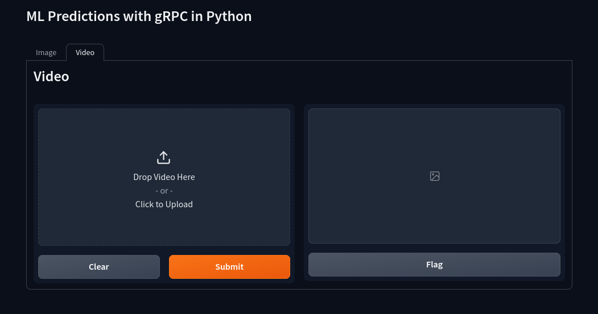
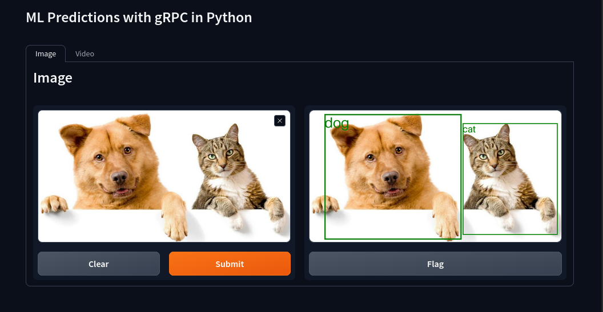
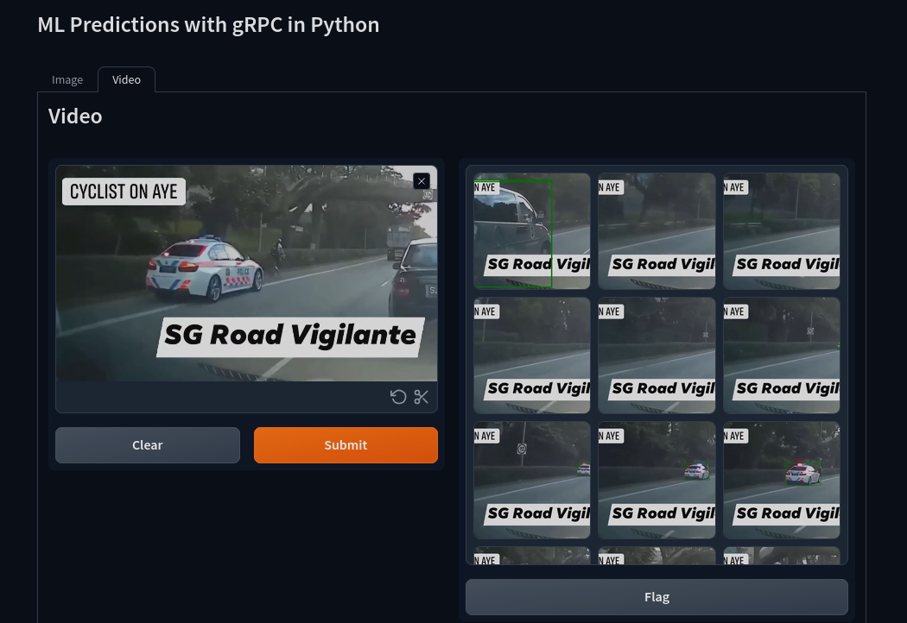

# ML Predictions with gRPC in Python

## Motivation
- gRPC allows for bi-directional streams
- this is good for ML predictions where one might have to send many samples all at once or have samples coming in asyncrhonously

## Requirements & Design


## Specifications
- Gradio for frontend
- Torch Hub to load model
- YOLOv5 (`yolov5m`) model from torch hub for predictions
  - Used a light-weight model that is easily accessible
  - Focus of this demo is gRPC, not the model predictions
  - Can swap out for other models if needed

## Usage Instructions
### Using Hatch
I use Hatch to manage my development environment and run scripts. If you do too, then I have already written the hatch commands to run this demo easily. Hatch should keep the environement dependencies updated.

#### Run server
```shell
hatch run serve
```

#### Run demo
```shell
hatch run demo
```

#### Optional; Generate gRPC code from protobuf
```shell
hatch run expt:gencode
```

### Using command line
#### Create virtual environment and install dependencies
```shell
python -m venv venv && source venv/bin/activate && pip install -r requirements.txt
```

#### Run server
```shell
source venv/bin/activate && python src/python_grpc_ml_demo/server.py
```

#### Run Demo
```shell
source venv/bin/activate && python src/python_grpc_ml_demo/client.py
```

## Screenshots
### Landing page
You will see two tabs. One for making predictions on images.


### Image prediction
Predict objects in image. (see [`PredictSingleImage`](src/python_grpc_ml_demo/server.py))


### Video prediction
Predict objects in video frames. (See [`PredictMultipleImages`](src/python_grpc_ml_demo/server.py))



You will see that multiple predictions can be made in a single connection.

From server logs.
```shell
INFO:__main__:Predicting multiple frames/images...
INFO:__main__:[RECEIVED FROM STREAM] frame 24
INFO:__main__:[RECEIVED FROM STREAM] frame 48
INFO:__main__:[RECEIVED FROM STREAM] frame 72
INFO:__main__:[RECEIVED FROM STREAM] frame 96
INFO:__main__:[RECEIVED FROM STREAM] frame 120
INFO:__main__:[RECEIVED FROM STREAM] frame 144

...

INFO:__main__:[RECEIVED FROM STREAM] frame 1320
INFO:__main__:[RECEIVED FROM STREAM] frame 1344
INFO:__main__:[RECEIVED FROM STREAM] frame 1368
INFO:__main__:End of predictions.
```

From client logs.
```shell
INFO:root:[RESULTS RECEIVED]... frame 24
INFO:root:[RESULTS RECEIVED]... frame 48
INFO:root:[RESULTS RECEIVED]... frame 72
INFO:root:[RESULTS RECEIVED]... frame 96
INFO:root:[RESULTS RECEIVED]... frame 120
INFO:root:[RESULTS RECEIVED]... frame 144

...

INFO:root:[RESULTS RECEIVED]... frame 1320
INFO:root:[RESULTS RECEIVED]... frame 1344
INFO:root:[RESULTS RECEIVED]... frame 1368
```